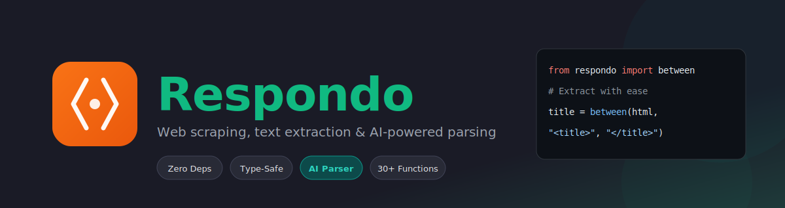
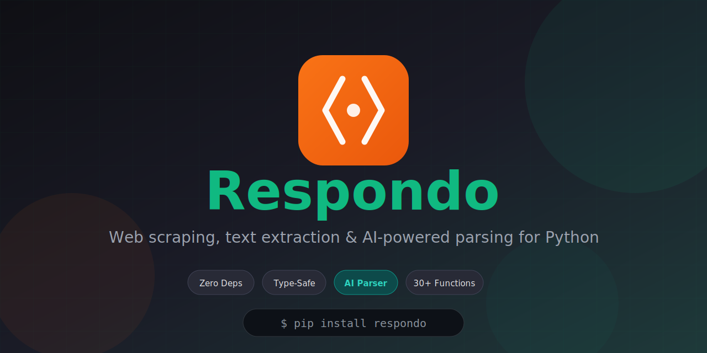
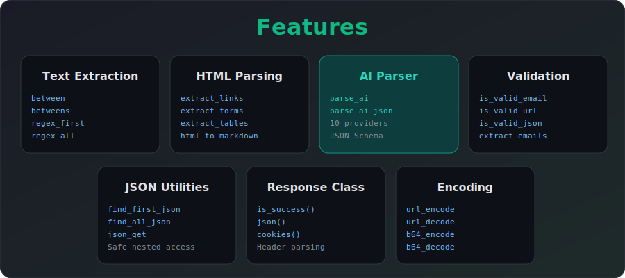

# Respondo Assets

Banner and branding assets for the Respondo library.

## Available Assets

### Main Banner



**File:** `banner-dark.svg`

Main banner for README header.

### Social Preview



**File:** `social-preview.svg` (1280x640)

Use this as your GitHub repository social preview image:
1. Go to your repo → Settings → General
2. Scroll to "Social preview"
3. Upload this image

### Features Showcase



**File:** `features.svg`

Shows all library capabilities at a glance.

---

## Usage in README

### Main Banner

```html

```

### Features Section

```html

```

---

**Remember:** Replace `YOUR_USERNAME` with your actual GitHub username.
